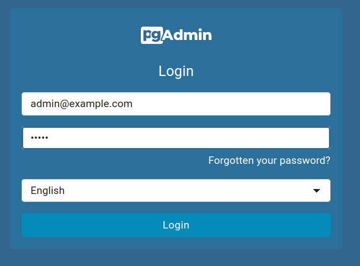
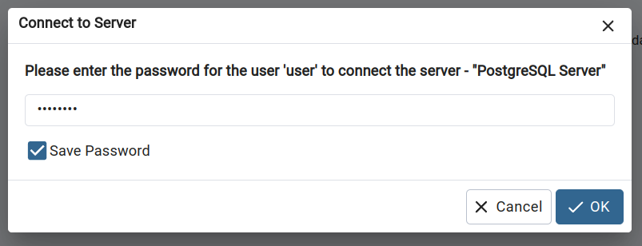

# Kepler test task

## How to run

### Install dependencies:

```bash
yarn install
```

### Create .env files:

```bash
yarn copy-envs
```

### Start docker services:

```bash
docker compose up
```

### Start application:

```bash
yarn start
```

Web app is available on http://localhost:5173.

Server is available on http://localhost:3000.

---

pgAdmin is available on http://localhost:8080.

**login for pgAdmin:** admin@example.com

**password for pgAdmin:** admin



Server password: password


